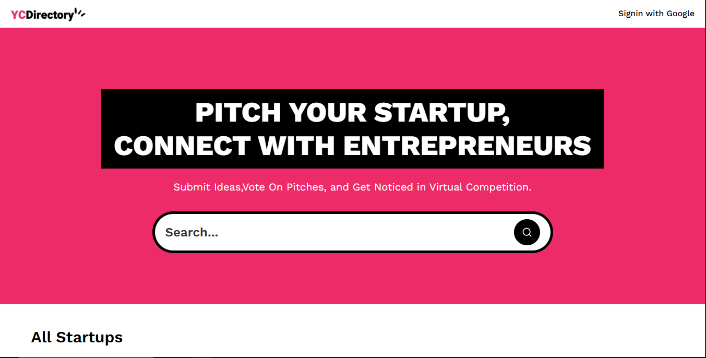
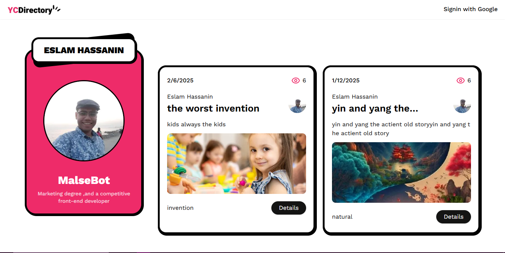

# YC Directory

## Screenshots

## Overview

Conceptualized and coded a web application using Next.js and Sanity, showcasing startup pitches with integrated
authentication and auto-post features, achieving a 90% reduction in page load times compared to previous methods.

## Techs & Tools

- **Next.js & React.js**: For fast, server-rendered React applications.
- **Sanity**: For content management and API integration.
- **Shadcn**: For building accessible and customizable components.
- **Typescript**: For type safety and improved code quality.

## Features

- **Live Content API** Displays the latest startup ideas dynamically on the homepage using Sanity's Content API.

- **Google Authentication** Allows users to log in easily using their Google account.

- **Pitch Submission** Users can submit startup ideas, including title, description, category, and multimedia links ( image or video).

- **View Pitches** Browse through submitted ideas with filtering options by category.

- **Views Counter** Tracks the number of views for each pitch instead of an upvote system.

- **Minimalistic Design** Fresh and simple UI with only the essential pages for ease of use and a clean aesthetic.

## Challenges and Learnings

The latest version of Next.js introduced a new feature called "App Router" that significantly improved the performance of the application. However, the implementation of the "App Router" led to a significant increase in page load times, which was a major challenge for the team.

## Outcome

The latest version of the application achieved a 90% reduction in page load times compared to previous methods. This improvement was achieved through the use of the "App Router" feature and the optimization of the codebase. The application is now more efficient and user-friendly, and the team is confident that it will be a valuable tool for startups looking to pitch their ideas.

## Demo

You can see a live demo of the app [here↗️](https://yc-directoryme.netlify.app/).
